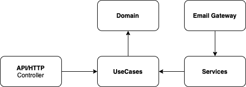

# simple-mail
A simple email API implemented using TypeScript, Node.js/Express.

### Setup Instructions

#### Requirements:
1. Node.js v16 LTS and above. 
2. Optional: Docker

#### Steps:
1. Clone the repository from GitHub using a Git Client or CLI.
2. Run "npm install" to download and install the dependencies.
3. After all dependencies have been installed, run "npm test" to launch the unit tests suites. All unit tests should pass.
4. Run "npm start" to launch the simple-mail service. 
5. Verify if the service has started by observing the following output on console: 
┌─────────┬───────────────────┬───────────────────────────┐
│ (index) │        api        │          handler          │
├─────────┼───────────────────┼───────────────────────────┤
│    0    │ 'POST /mail/send' │ 'MailController.sendMail' │
└─────────┴───────────────────┴───────────────────────────┘
Server is listening on :4000

6. Use any API testing tool ie. Postman/Insomnia and test the endpoint with the following specification:

POST http://localhost:4000/mail/send HTTP/1.1
Content-Type: application/json

{
  "to": ["marco.polo@gmail.com", "john.smith@outlook.com", "jane.doe@yahoo.com"],
  "from": "tom@jerry.com",
  "cc": ["marco.polo@gmail.com", "john.smith@outlook.com"],
  "bcc": ["marco.polo@gmail.com", "john.smith@outlook.com"],
  "subject": "Test email 123",
  "text": "Plaintext version of the message",
  "html": "
HTML version of the message
"
}

##### Expected Result: 
HTTP/200 - "Email successfully sent."

#### Steps (with Docker):
1. Clone the repository from GitHub using a Git Client or CLI.
2. Ensure that docker is present on the environment used to run this application.
3. Run "docker build . -t <username>/simple-mail" to build the docker image as specified in the dockerfile.
4. Check if docker image is successfully created by running "docker image".
5. Run the image by running "docker run -p <port>:4000 -d <username>/simple-mail".
6. Please continue with step 6. in the original steps above. 

#### Architecture & Implementation

1. The simple-mail service is implemented with a Node.js/Express framework using TypeScript. The NodeMailer module is used as mail delivery client to external email services via SMTP.

2. The design of the architecture is largely based on principles from the Clean/Hexagon/Onion software architecture. This is to achieve clear separation of concerns between business logic and infrastructure code.

3. Domain-driven design (DDD) elements help to better encapsulate behaviours and reuse through value objects, entities and guards.

#### Limitations & Constraints

1. The simple-mail service does not have any authorization to secure the services. Future work for integrating with auth service for OAuth2 authorization flow is required.

2. Email sending functionality does not support attachments due to time constraints. 

3. Even we are able to post any "from" email address but it will be override by email configured at mail.config.

4. Email security type is restricted to OAuth2 instead of basic SMTP user/password.
	
5. Validation on incoming request is done sequentially and will return upon error encountered instead of returning a result for the entire payload.

5. There a couple of areas could use some refactoring to simplify the implementation such as email-message-map.ts.

	
	
	

